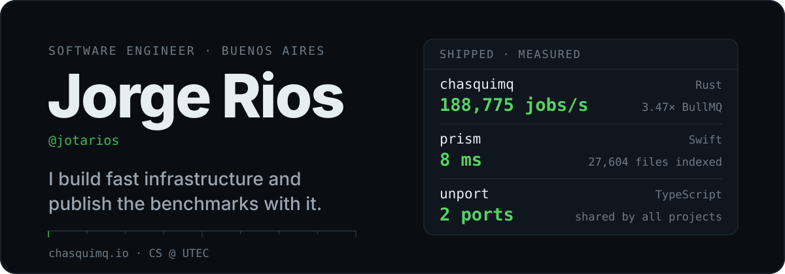
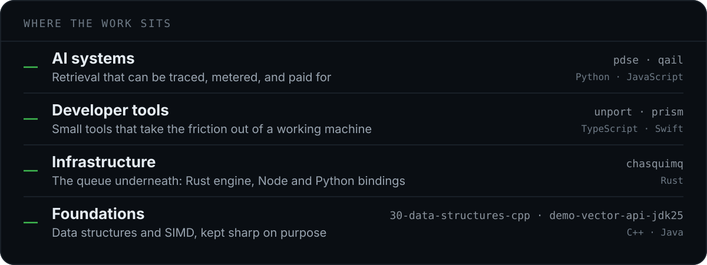
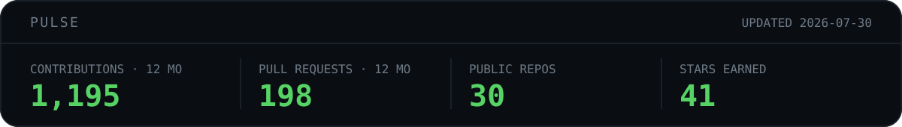

  

I'm a backend and systems engineer in Buenos Aires, currently at [@trysandbar](https://github.com/trysandbar). Most of what I build sits close to the metal: a message broker, a file index, some local dev tooling. I put the benchmark table in the README, because a speed claim you can't check isn't worth much.

Before Argentina I studied CS at UTEC in Peru, which is still where most of my instincts about data structures come from.

## What I'm building

- [chasquimq](https://github.com/jotarios/chasquimq) is a Redis-backed message broker and job queue with a Rust engine, MessagePack payloads, and native Node and Python bindings, so handlers run in the language you wrote them in. It reaches 188,775 jobs/s on bulk enqueue, 3.47× BullMQ on the same machine. Published to [crates.io](https://crates.io/crates/chasquimq), [npm](https://www.npmjs.com/package/chasquimq) and [PyPI](https://pypi.org/project/chasquimq/), with docs at [chasquimq.io](https://chasquimq.io).

- [unport](https://github.com/jotarios/unport) runs Docker Compose projects at real hostnames like `https://api.shop.test` instead of a pile of localhost ports. It holds two ports for the whole machine, writes one generated override file, and leaves `docker compose up` working the way it always did.

- [prism](https://github.com/jotarios/prism) is filename search for macOS, built the way *Everything* works on Windows. DuckDB holds the metadata, SQLite FTS5 holds the index, and a memory cache sits on top: about 8 ms to search 27,604 indexed files, and it still answers when the external drive is unplugged.

- [pdse](https://github.com/jotarios/pdse) answers questions about multi-hour podcasts with clickable timestamp citations. I built the instrument panel before the features, so every search emits a trace carrying its token cost, retrieval scores, and grounding signal.

- [qail](https://github.com/jotarios/qail) reads a cold email inside Gmail and scores it before you send: spam risk, tone, personalization, and the reply you are likely to get back.

  

Around those languages, the tools I keep coming back to: Redis, Postgres, DuckDB and SQLite for storage, Docker for anything local, and enough CI to keep a benchmark honest between commits.

## Elsewhere

- [chasquimq.io](https://chasquimq.io) for docs and writing about the broker
- [@jotarios_](https://x.com/jotarios_) on X
- [j29.rios@gmail.com](mailto:j29.rios@gmail.com) if you have a problem with a latency budget

  

The numbers above are regenerated weekly by <a href="./.github/workflows/pulse.yml">a small workflow</a> that queries the GitHub API and commits the SVG, so nothing here depends on a badge service staying online.
